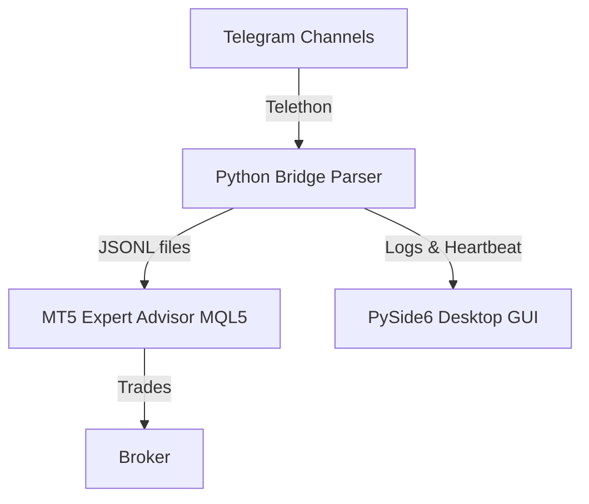

<div align="center">

# FluentSignalCopier

**A production-ready Telegram → MetaTrader 5 signal bridge with advanced risk management.**

[](https://github.com/The-R4V3N/FluentSignalCopier/releases)
[](https://github.com/The-R4V3N/FluentSignalCopier)
[](LICENSE)
[](https://www.python.org/)
[](https://github.com/The-R4V3N/FluentSignalCopier/commits/dev)

Turn any Telegram trading channel into automated MT5 trades — hands-free.

[How It Works](#how-it-works) · [Quick Start](#quick-start) · [Features](#features) · [Troubleshooting](#troubleshooting)

</div>

---

## How It Works



**Input** — A Telegram signal message:

```
XAUUSD BUY Limit
Entry: 1985.50
Stoploss: 1980
TP: 1990
TP: 1995
TP: 2000
```

**Output** — Automatic MT5 order with risk management, placed in under 200ms.

---

## Quick Start

**1. Clone the repo**

```bash
git clone https://github.com/The-R4V3N/FluentSignalCopier.git
cd FluentSignalCopier
```

**2. Install dependencies**

```bash
pipx install poetry   # if not already installed
poetry install --no-root
```

**3. Configure**

Copy `.env.example` to `.env` and fill in:

| Variable | Description |
| -------- | ----------- |
| `TELEGRAM_API_ID` | From [my.telegram.org](https://my.telegram.org) |
| `TELEGRAM_API_HASH` | From [my.telegram.org](https://my.telegram.org) |
| `TELEGRAM_PHONE` | Your phone number |
| `WATCH_CHATS` | Channel IDs or usernames to monitor |
| `MT5_FILES_DIR` | Path to your MT5 `Files` directory |

**4. Run**

```bash
# Desktop GUI (recommended)
poetry run python fluent_copier_new_gui.py

# Headless bridge only
poetry run python telegram_bridge.py
```

**5. Attach the MT5 EA**

- Copy `FluentSignalCopier.mq5` into `MQL5/Experts/`
- Compile in MetaEditor
- Attach to a chart with AutoTrading enabled

---

## Desktop GUI


The modern PySide6 + QFluentWidgets interface includes:

- Signal quality slider (confidence filter)
- Real-time log viewer with color-coded severities
- Emergency Close All button
- Chat picker with auto-complete
- Telegram API configuration and MT5 auto-detection
- Risk management parameter controls


---

## Features

| Category | What it does |
| -------- | ------------ |
| **Signal Parsing** | Handles messy, human-written signals — emojis, comma/dot decimals, mixed formats |
| **Order Types** | Distinguishes market orders from pending orders (`BUY LIMIT`, `BUY STOP`) |
| **Multi-TP** | Splits positions across multiple take-profit levels |
| **Break-Even** | Automatically moves SL to entry when TP1 is hit |
| **Risk Management** | Lot caps, % risk, dollar caps, per-instrument safety |
| **Selective Close** | Close-by-OID closes only related trades, preserving swing positions |
| **Broker Compatibility** | Symbol mapping (`US30 → DJ30`), prefix/suffix support |
| **Monitoring** | Real-time log streaming, heartbeat health checks, CRITICAL alerts |

### Signal Format Examples

**Market order:**
```
XAUUSD Buy Now
SL 3341
TP 3362
```

**Pending order:**
```
#XAUUSD BUY LIMIT 3347
STOPLOSS @ 3320
TP @ 3357
```

**Risk controls:**
```
XAUUSD Buy
RISK 2%
HALF RISK
```

---

## Performance

- **~99% parsing accuracy** on diverse live signal formats
- **Sub-200ms latency** from Telegram to MT5 (local benchmarks)
- **500+ signals/day** capacity tested across 20+ channels
- **>99.9% uptime** observed during extended production runs
- **<50MB RAM** under standard workloads
- **100+ concurrent channels** verified in testing

---

## Security

- **Telegram transport**: Encrypted MTProto API via Telethon
- **MT5 bridge**: Local file I/O via `MQL5/Files` — no network exposure
- **Input validation**: Applied to all signal parsing
- **Audit logging**: Every trade decision is logged with timestamp

---

## Troubleshooting

| Issue | Solution |
| ----- | -------- |
| `poetry: command not found` | Add `%APPDATA%\Python\Scripts` to your PATH |
| Poetry picks Python 3.13 | Run `poetry env use <path-to-python311.exe>` |
| PySide6 install fails | Python 3.13+ is not supported — use 3.11 or 3.12 |
| No trades placed | Check EA is attached, AutoTrading is enabled, symbols match |
| Symbol not found | Add symbol to Market Watch, check prefix/suffix settings |
| Multiple opens for one message | Enable deduplication in GUI settings |
| Wrong trades closed | Enable close-by-OID in GUI settings |

---

## Development

### Branch Structure

- `master` — protected release branch
- `dev` — main development branch
- `feature/*` — feature branches, PR into `dev`

Direct pushes to `master` are blocked. All changes go through PRs.

### Setup

```bash
git clone https://github.com/The-R4V3N/FluentSignalCopier.git
cd FluentSignalCopier
./scripts/install-hooks.sh   # installs pre-push protection
poetry install --no-root
poetry run pytest            # run tests
```

Commit messages must follow [Conventional Commits](https://www.conventionalcommits.org/) — enforced via `commitlint`.

---

## Disclaimer

This software does **not** constitute financial advice. Trading involves risk. Always test on a demo account first and never risk more than you can afford to lose.

---

## License

Licensed under the [Fluent Signal Copier License](LICENSE).

---

<div align="center">

*built for traders, by a trader*

</div>
